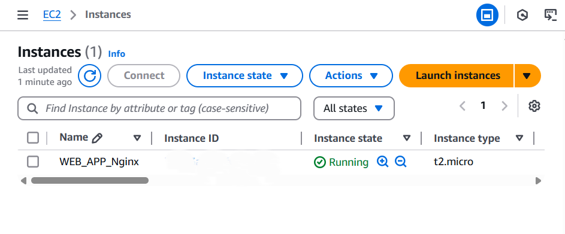
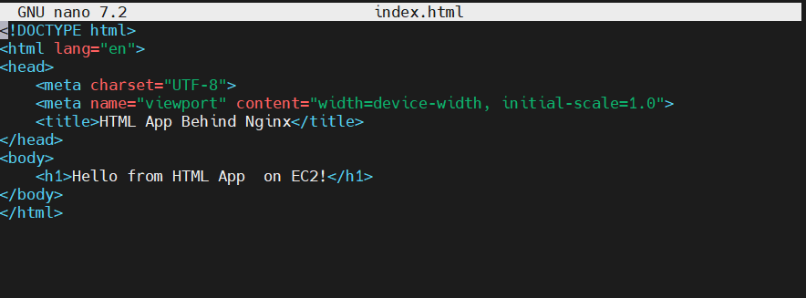
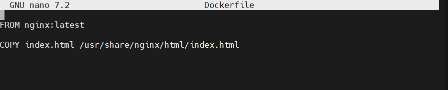
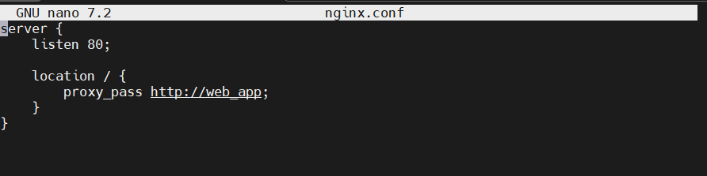
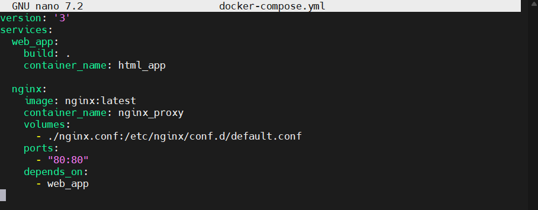
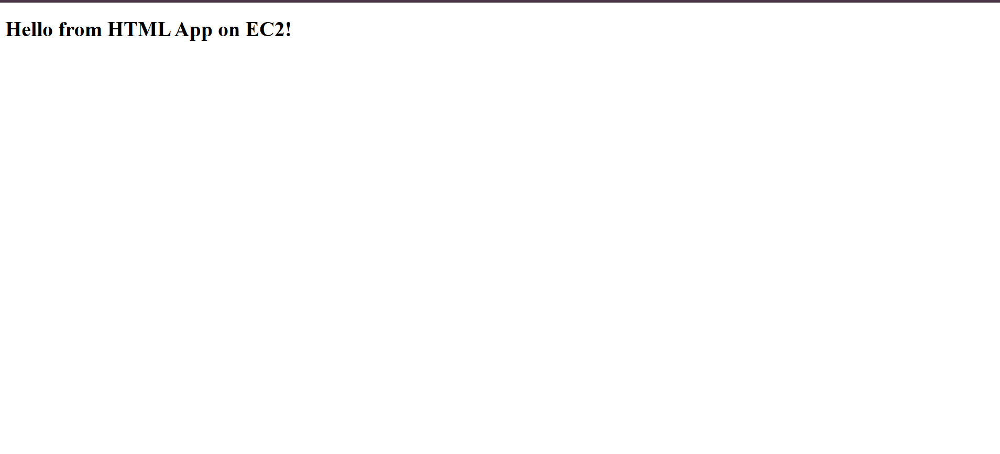

# DAY-2 Project
   Deploy a Web Application Using Docker and Nginx Reverse Proxy

## Objective
   - Containerize a web app and set up *Nginx as a reverse proxy* for better traffic management

## STEPS -
 # 1. Launch an EC2 Instance
   - Name: WEB_APP_Nginx
   - AMI: Ubuntu
   - Instance type: t2.micro
   - Allow SSH and HTTP traffic from the internet
     
   - Connect with SSH
     ```bash
        ssh -i "your-key.pem" ubuntu@<EC2-Public-IP>         # Ubuntu
   
# 2. Update System & Install Docker
```bash
sudo apt update && sudo apt upgrade -y

# Install Docker
sudo apt install docker.io -y

# Start and enable Docker services
sudo systemctl start docker
sudo systemctl enable docker
```
# 3. Install Docker-Compose
```bash
 # Install Docker Compose
sudo curl -L "https://github.com/docker/compose/releases/download/v2.22.0/docker-compose-$(uname -s)-$(uname -m)" -o /usr/local/bin/docker-compose

# Set executable permissions
sudo chmod +x /usr/local/bin/docker-compose

# Verify installation
docker-compose --version
```
# 4. Create project Directory
```bash
# Create and navigate to the project folder
mkdir web-app && cd web-app
```
# 5. Create HTML File
```bash
sudo nano index.html
```


# 6. Create Dockerfile
 ```bash
  sudo nano Dockerfile
```


# 7. Create Nginx
 ```bash
  sudo nano nginx.conf
```


# 8. Create Docker Compose File
 ```bash
  sudo nano docker-compose.yml
```


# 9. Build and Run Containers
```bash
sudo docker-compose.yml
```

# 10. Access Your Application
 ```bash
    http://<EC2-Public-IP>
  ```
 
   
